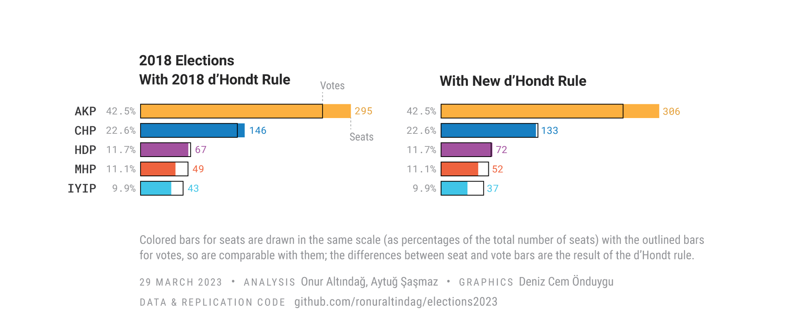
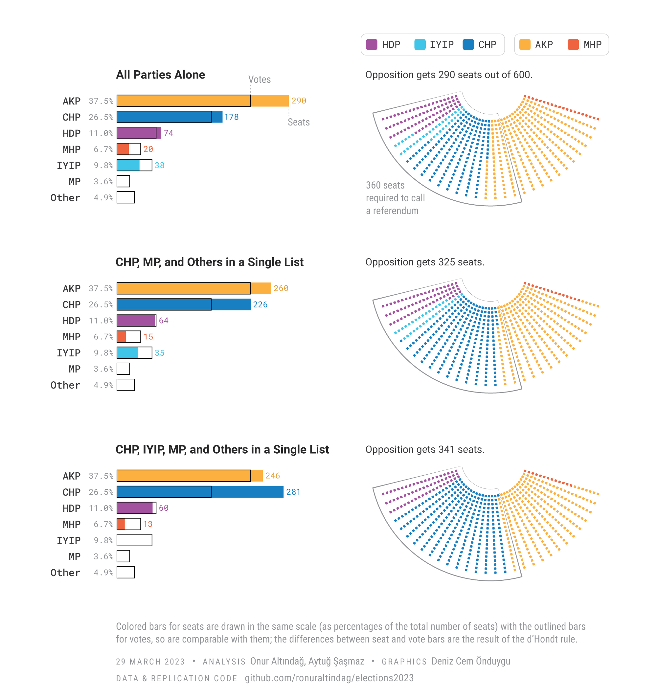

### Challenges Facing Turkey's Opposition in Upcoming Elections 

In less than 50 days, on May 14, Turkey will hold a pivotal election, with both presidential and parliamentary seats up for grabs. After 20 years of President Erdogan’s Islamist party’s rule, the united opposition has a real chance to unseat him and his party. While the presidential election has garnered much attention, the parliamentary race is just as crucial. 

In 2017, President Erdogan used a familiar tactic employed by autocratic leaders: he conducted a controversial referendum during a state of emergency, which resulted in a hyper-presidential system that severely limited checks and balances on his power. The opposition's main objective is to alter this Putinesque system, and to restore the power that the parliament and judiciary once held. A big chunk of the opposition, led by the secular main opposition party CHP and five other conservative and right-wing parties, formed an electoral alliance and agreed on the constitutional amendments they plan to introduce.

For a constitutional reform, the opposition requires the support of at least 360 out of 600 parliamentarians to call a referendum, or a supermajority of 400 votes to pass it in parliament without a referendum. However, the opposition faces a daunting array of challenges.

### The method of seat allocation 

Parliamentary elections in Turkey are conducted using a proportional representation system, meaning that the number of seats each party gets should reflect the percentage of votes they receive. However, the d'Hondt method is used to allocate seats, which disproportionately benefits parties with more supporters. Recent changes to the allocation mechanism have made this problem worse. In the 2018 elections, seats were allocated to alliances, but in the upcoming elections, seats will be allocated directly to parties, favoring Erdogan's AKP party. The AKP is still the largest party in the country with uniform support across districts, and this change is expected to make it more difficult for smaller opposition parties to secure balanced representation in parliament.

We analyzed the impact of the recent changes to the allocation system on party representation in upcoming parliamentary elections. Based on the 2018 general election results, the graph below shows the distribution of seats for each party in the parliament.

In 2018, the ruling coalition had secured 53.7% of votes and 344 seats (57.3% of seats). The opposition alliance had 32.6% of votes and 189 seats (31%). The pro-Kurdish HDP party, also opposing Erdogan but not part of the opposition alliance, received 11.7% of the vote and secured 67 seats (11.2%). 

According to our analysis of seat distribution in the 2018 general elections, the newly imposed allocation system would increase the ruling coalition’s seat count by 17 and decrease the opposition alliance’s seats by 19. This is because the 2018 system had first allocated the seats to alliances, and then to the parties. When the AKP saw that this system was benefitting the opposition, they changed it in advance of the 2023 elections. The pro-Kurdish HDP party, on the other hand, is projected to benefit from the new allocation system due to its strong showing in Kurdish provinces. 

The overall impact of the new allocation system on opposition parties is significant, and it should spark concern among democracy advocates who had hoped for a positive shift towards strengthening Turkey's democratic institutions. The system's potential to advantage the ruling coalition, coupled with collective action problems for opposition parties, pose a significant challenge to the opposition's efforts to achieve a more balanced representation. 

### Three scenarios of seat allocation in the 2023 elections

To estimate seat allocations in the elections, we re-calibrated our model based on a recent poll by [Türkiye Raporu](https://turkiyeraporu.com). Most polls currently show a significant loss of support for the ruling coalition: Kemal Kılıçdaroğlu, the presidential candidate of the opposition, might win the presidential election with a comfortable margin. Still, the ruling coalition of AKP and MHP would have a parliamentary majority of 310 seats. To explore a more optimistic scenario, we assumed that the opposition coalition would run a single list in each province, except for the İyi Party, which wants to demonstrate its power by running under its own banner. We also added the Memleket (Homeland) Party, a splinter party of CHP founded by their previous presidential candidate Muharrem İnce, currently polling around 4 percent.

Based on this scenario and seat distribution analysis, it appears unlikely that the opposition will be able to achieve a qualified majority to introduce a constitutional reform through a referendum. Even with the participation of İyi Parti in the joint candidate list (our third scenario) and the inclusion of the pro-Kurdish HDP, the opposition bloc is projected to receive 340 seats, still falling short of a qualified majority. Given the current polling results and intricacies of the electoral system, it seems that a constitutional reform is unlikely.

To escape competitive authoritarian systems, political scientists have a clear recipe: bring the opposition together. However, recent elections in Hungary have added a new qualification - the opposition must not be seen fragmented and should always project cohesion and cooperation. In order to bring democracy back to Turkey, both large and small opposition parties must focus on increasing their vote shares and coordinating their electoral efforts. This requires coming to terms with the fact that constitutional reform is close to impossible without the support of the HDP. Additionally, they should find ways to run on joint lists despite financial incentives to run party lists, as treasury grants are only available to parties that run their own lists. Finally, every opposition leader should set aside personal grievances and work towards a united opposition.

Our projections underscore the uphill battle faced by the opposition in their efforts to end the long reign of President Erdoğan and rebalance the distribution of power in Turkey's democracy. While Kılıçdaroğlu’s potential victory in the presidential election would be a significant milestone for the opposition, their ability to effect real change remains uncertain. As the country approaches this critical election, the polls and projections serve as a sobering reminder of the complex dynamics at play and the need for ongoing vigilance and engagement in the democratic process.

----------
**Note**: We are grateful to Stephen Moncrief for editorial support. Data and replication code for the simulations are [here.](https://github.com/ronuraltindag/elections2023)

