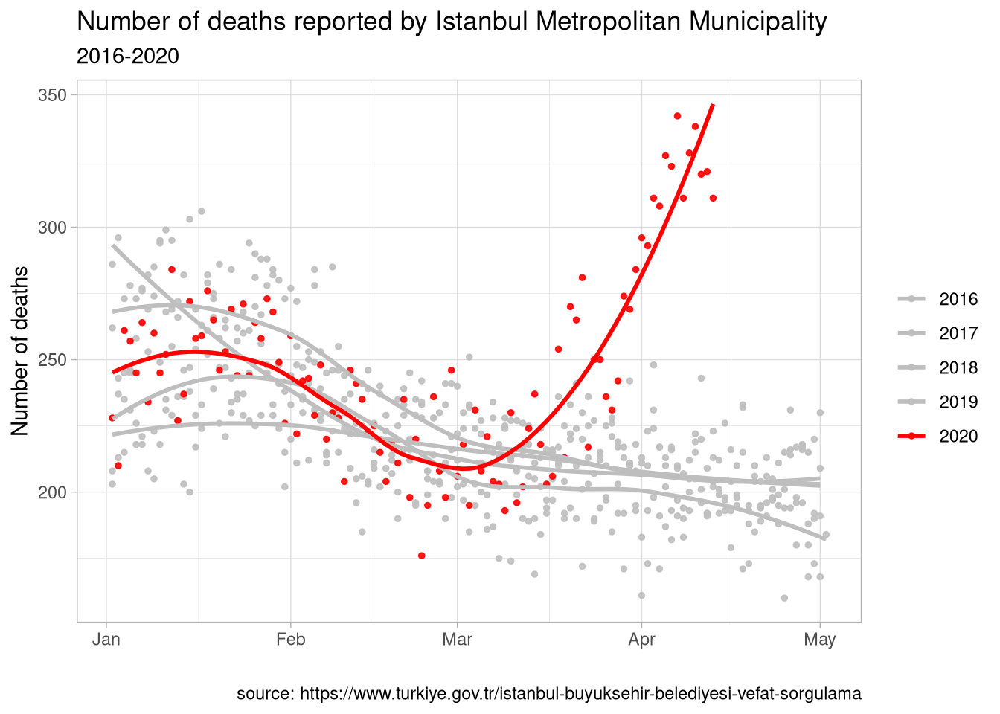
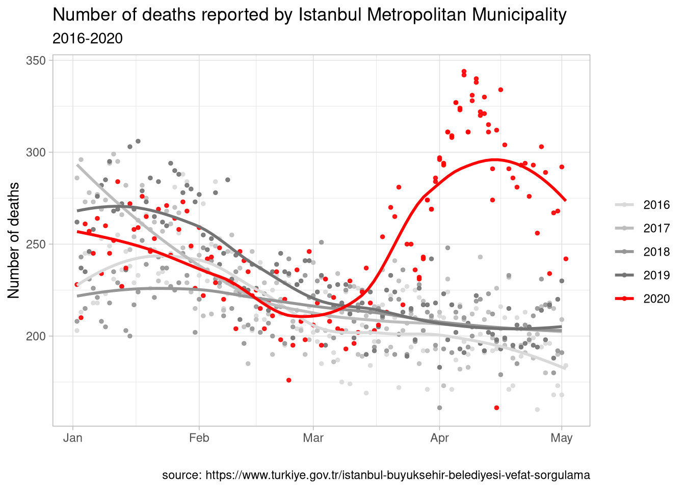
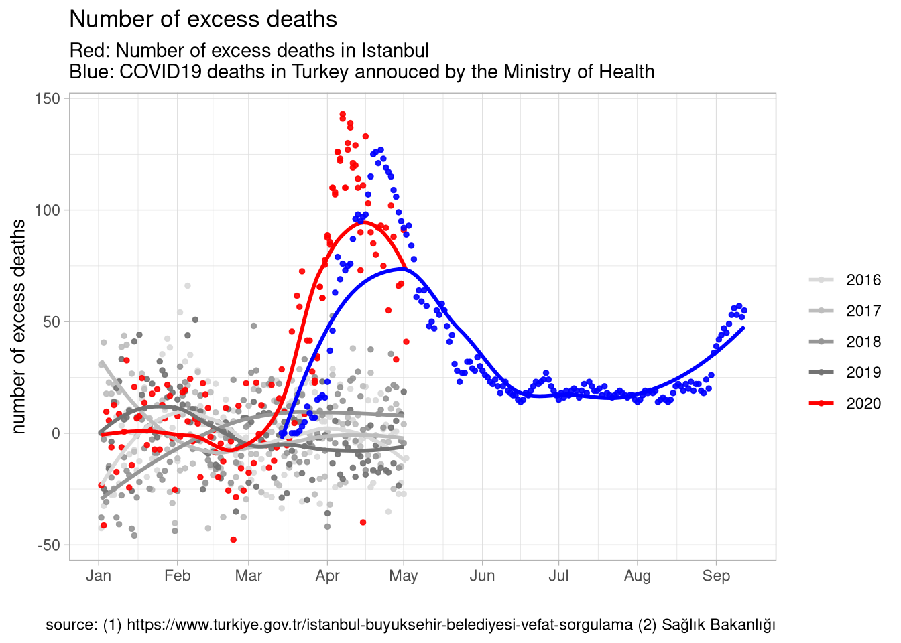

The Turkish Ministry of Health announces the death toll due to novel coronavirus cases on a daily basis. These statistics are based on confirmed COVID19 cases. Like other countries, Turkey does not include people who died without proper medical diagnoses into the official statistics. As such, the number of patients who died directly or indirectly due to COVID19 tend to be higher than the numbers in official statistics.

In any country, the degree of underreporting depends on the institutional capacity of the state and the extent to which the pandemic is affecting the locality. One could expect underreported figures to be higher in developing regions and hard-hit locations. In addition to measurement error in excess deaths due to the pandemic, localities with a high prevalence of disease may have a severely overwhelmed health care system, which increases other-cause mortality. Finally, changes in lifestyle affect mortality by reducing all-cause mortality in the general population (*e.g.*, via reductions in motor vehicle accidents, better care for the elderly), at least for those who are spared of the infection.1

Existing studies suggest substantial variation in underreporting in COVID19 deaths across countries. According to [The Economist](https://www.economist.com/graphic-detail/2020/04/16/tracking-covid-19-excess-deaths-across-countries), for example, the total death toll in Italy and the Netherlands is more than twice the official reported numbers; in Spain, UK, and USA, excess mortality due to COVID19 is between 10%-60% of the official reported figures.

## Coronavirus deaths in Istanbul and Turkey

The Turkish Medical Association [announced](http://www.cumhuriyet.com.tr/haber/ttb-saglik-bakanligi-kovid-19-olumlerini-dunya-saglik-orgutu-kodlarina-gore-raporlamiyor-1731938) that patients who show clinical symptoms of COVID19 yet died without diagnosis with the COVID-19 RT-PCR test are not included in the official COVID-19 death statistics. In other words, the official figures include both measurement error but the magnitude of underreporting is unclear. Estimating the death toll that corrects for underreporting is important from a public health perspective, which is the aim of this blog post.

The graphic below shows the daily number of reported deaths/burials between January 2016 and April 2020 reported by the Istanbul Metropolitan Municipality. These numbers include all individuals whose funeral took place in Istanbul.2 I indicated the year 2020 in red, which shows a dramatic increase in the beginning of March that continues through the second week of April. To assess the degree of excess mortality during this period, I used a simple regression to predict what the expected number of deaths would be without COVID-19 in 2020 using the previous years and months. Next I subtract the expected number of deaths from the actually observed to estimate the excess mortality due to COVID-19.

The **red** line in the second graph shows these estimated excess mortality figures, which indicates an excess mortality of 2,158 individuals [95% CI: 1,976 - 2,340] in Istanbul between March 12 - April 11. The Turkish Ministry of Health does not report COVID19 deaths by province but the total COVID19 deaths reported during the same period was only [1,006](https://opendata.ecdc.europa.eu/covid19/casedistribution/csv) for the entire country. The black line on the same graph shows the total number of COVID deaths announced by the Turkish Ministry of Health.  The excess mortality in Istanbul, in other words, was twice the official number of COVID19 deaths in Turkey between mid-March and mid-April. 

There are many reasons why we might see a discrepancy between the official numbers and the excess mortality that comes from burial statistics. For example: 

- Due to lack of testing capacity coupled with false negative test results, **patients are registered with a secondary ICD10 code** such as pneumonia or infectious disease when they die with clinical COVID19 symptoms.  

- Those who die in Istanbul would, under normal circumstances, be transported to their hometown for the funeral. Due to restrictions on travel, curfews, and other precautions these **funerals took place in Istanbul instead of hometowns**, which increases the number of recorded deaths in Istanbul this year.  

- Restricted access to healthcare due to overwhelmed hospitals and/or decreased demand for health care related to fear of hospital visits **increased mortality related to other causes**. 

Another striking pattern in the second graph is the abrupt increase in excess mortality which began earlier than the first reported COVID19 deaths in Turkey. The uptick in excess mortality is around the beginning of March whereas the first reported COVID19 cases come around mid-March.   

## Other Provinces

The funeral data are publicly available for another 9 provinces in Turkey. None of these provinces have an excess mortality pattern that is as striking as Istanbul. Perhaps with the exception of Bursa and Sakarya, most provinces follow the same mortality pattern that they did over the previous years for which I collected data. Why the burial statistics in Istanbul are quite different from others is an important question yet impossible to answer with the publicly available data. The Ministry of Health should shed light on the mystery. 

----------

1[Here](https://voxeu.org/article/economic-crises-and-mortality) is a good summary of the research on the relationship between business cycle and mortality. 

2 Data is publicly available [here](https://www.turkiye.gov.tr/istanbul-buyuksehir-belediyesi-vefat-sorgulama).

---------

## Updated figures for Istanbul 

Below are the updated excess death figures from Istanbul death registries and COVID19-related deaths reported by the Ministry of Health for the full population 

