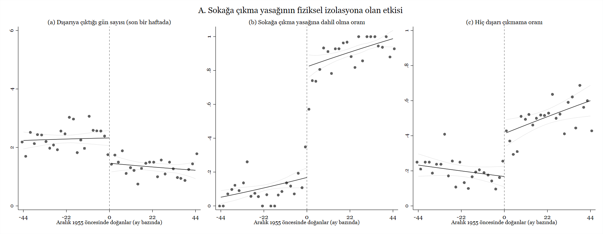
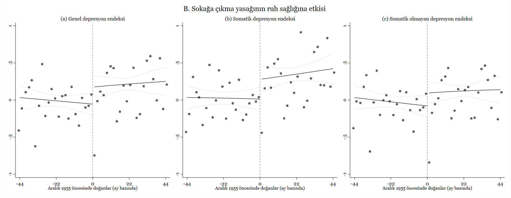

Covid-19 ile  mücadele için alınan önlemler arasında psikolojik olarak belki de en ağır olanı karantina. Karantina yüksek risk grubundaki bireyleri daha fazla etkiliyor. Bu grup pandemi boyunca daha az hareket ediyor ve sosyal olarak kendini daha çok izole ediyor. Bu bireylerin mevcut sağlık durumunu toplum genelinden halihazırda daha kötü olduğu için,  hareketsizlik ve sosyal izolasyonun fiziksel ve ruh sağlığına etkisi daha da riskli bir konuma evriliyor. Devlet tarafından uygulanan karantina politikaları salgının yayılmasını yavaşlattığı için birçok ülkede halk tarafindan kabul ediliyor ve uygulanabiliyor1 ancak tecritin insan psikolojisi üzerinde ne tür etkiler yarattığına dair çok fazla fikir sahibi değiliz. 

Türkiye, COVID-19 ile mücadele için yapılan  sosyal kısıtlama uygulamalarında dünyanın geri kalanından farklı bir yol izledi. Hastalığa bağlı ilk kayıtlı ölüm vakası 17 Mart’ta açıklandıktan dört gün sonra 65 yaş ve üstü ile kronik rahatsızlığı olan nüfusa sokağa çıkma yasağı getirildi. Başka bir ülkede benzeri olmayan bu uygulama, 10 Mayıs’a kadar aralıksız devam etti. 65 yaş ve üstü nüfusa ilk defa 10 Mayıs’ta sağlanan 4 saat süreli dışarı çıkma özgürlüğünü takiben 21 Mayıs’ta yine bir defaya mahsus olmak üzere seyahat izni verildi. 29 Mayıs itibariyle iş sahiplerinin sokağa çıkma yasağı gevşetildi ve nihayet 10 Haziran itibariyle bütün 65 yaş ve üstü nüfusa gündüz saatleri dahilinde sokağa çıkma özgürlüğü geri verildi.

Bu tecrit politikasinin salgının yayılmasını yavaşlatmak ve ölümleri azaltmakta ne kadar etkili olduğunu belirlemek çok zor. Sağlık Bakanlığı pandeminin başladığı ilk günden bu yana şeffaf ve detaylı bir şekilde veri paylaşmıyor. Paylaştığı veriler de az bildirim nedeniyle sağlıklı bir istatistiki analizi mümkün kılmıyor. Teste erişim zorluğu ve test yapıl(a)madan hayatını kaybeden vakaların farklı ICD kodlarıyla kayıt edilmesi (ölüm nedeninin Covid-19 olarak belirtilmemesi) gibi nedenler de eklenince, resmi olarak açıklanan rakamların [buz dağının görünen kısmı olduğunu tahmin ediyoruz](/blog/excess_mortality_tr/). Türk Tabipler Birliği uzun süren uygulamanın ölçüsüz olduğunu, yaşlı insanlara karsi bir ayrımcılık halini aldığını ve 65 yaş ve üstündeki nüfusun fiziksel ve ruhsal sağlığını  tehdit eder hale geldiğini [bildirdi](https://www.ttb.org.tr/haber_goster.php?Guid=7ad41de6-cc03-11ea-ae98-95a88cc32d95). 

Biz de Northeastern Üniversitesi’nden [Bilge Erten](http://www.bilgeerten.com/) ve Wellesley Koleji’inden [Pınar Keskin](https://www.pinarkeskin.com/) ile birlikte yaptığımız araştırmada bu konuya odaklandık. 65 yaş ve üstü nüfus için getirilen sokağa çıkma yasağının devam ettiği Mayıs sonu ve Haziran başında [Konda Araştırma ve Danışmanlık şirketi](https://konda.com.tr/tr/anasayfa/) ile işbirliği yaparak Türkiye genelinde 59 ve 70 yaş aralığında ve kentlerde yaşayan  2000’e yakın kişiyle telefon görüşmeleri yaptık.  Görüşmenin başında  katılımcılardan  nüfus cüzdanlarına bakmalarını ve  bize tam doğum tarihlerini söylemelerini istedik. Daha sonra  somatik olmayan depresyon semptomlarına (konsantrasyon güçlüğü, intihar düşüncesi, vb.) ve somatik depresyon semptomlarına (hazımsızlık, baş ağrısı vb) dair sorular içeren bir anket uyguladık. Bu sorular psikoloji literatüründe klinik olmayan durumlarda kişilerin ruh sağlığını anlamak için  rutin olarak kullanılmakta. 

Topladığımız veriyi regresyon süreksizliği analizi kullanarak inceledik. Sokağa çıkma yasağından 65 yaşından birkaç ay daha genç oldugu için etkilenmemiş nüfus ile 65 yaşının hemen üzerinde olduğu için 2,5 aya yakın karantinada kalmış nüfusu karşılaştırdık. 

Aşağıdaki grafik gözlemlediğimiz sonuçların güzel bir özetini sunuyor: 65 yaşın biraz üzerinde olduğu için sokağa çıkma yasağına takılan nüfus, 65 yaşının hemen hemen altındaki
gruba göre yüzde 45 (haftada 1 gün) daha az dışarıda vakit geçirmiş. Yaş nedeniyle sokağa çıkma yasağına takılanların hiç dışarıya çıkmamış olma ihtimalleri yasağa dahil olmayan gruba kıyasla 1,5 kat daha fazla. Bu sonuçlar bize sokağa çıkma yasağına nüfusun büyük çoğunluğunun riayet ettiğini ve politikanın başarılı bir şekilde uygulandığını gösteriyor. 

Beyan edilen depresyon belirtilerine beklediğimiz gibi ev tecriti yaşayan grupta çok daha sık rastlanıyor. Karantinanın uykusuzluk, iştahsızlık, hayata karşı ilgisizlik, korku ve yalnızlık gibi olumsuz ruh hallerini tetiklediğini görüyoruz. Bunun yanında yine olumsuz ruh haline bağlı baş ağrısı, el titremesi, hazımsızlık gibi fiziksel göstergelerin de arttığını buluyoruz. Somatik ve somatik olmayan depresyon endeksleriyle özetlediğimiz değerlerin tümünde çok belirgin artışlar var. Standardize edilmiş değerlere göre 0.2-0.3 standard sapmalık bir sıçrama söz konusu ki bu karantinanın yüksek risk grubu yaşlı nüfusun ruh sağlığını belirgin bir şekilde kötü etkilediğini ortaya koyuyor. 

Araştırmamızda ruhsal sağlığı kötü etkileyen faktörleri de incelemeye çalışıyoruz. Anketimizde karantina altında uzun bir dönem geçiren nüfusun günlük hayatlarının ne şekilde değiştiğini sorduk. Aldığımız cevaplar depresyon semptomlarındaki artışı tetikleyen en güçlü unsurların sosyal izolasyon, arkadaş ve akrabalarla görüşmeme ve fiziksel hareketsizlik olduğunu ortaya koyuyor. Bu sonuçlara göre ekonomik belirsizlik ve aile içi gerginlik gibi nedenler, pandemi sürecinde gelişen depresyon üzerinde diğer etkenler kadar etkili değil. Araştırmamız genel olarak karantina politikalarının görece yüksek bir ruh sağlığı maliyetinin olduğunu ortaya koyuyor. Ortaya çıkan bu olumsuzluğu azaltıcı politikaların geliştirilmesi gerekli.

------

1 ABD gibi politik polarizasyonun çok güçlü olduğu ülkeleri bir kenara bırakıyorum.

**Not**: Çalışmamızı  daha teknik ve detaylı bir şekilde anlatan makalemize buradan ulaşabilirsiniz.  Her zamanki gibi araştırma süresince bize sürekli destek olan Konda ekibine tekrar teşekkür ediyorum. Ayşegül, Aytuğ, Fatmagül,  Ladin, ve Zeynep'e metin düzenlemeye ayırdıkları vakit  için minnettarım.  

